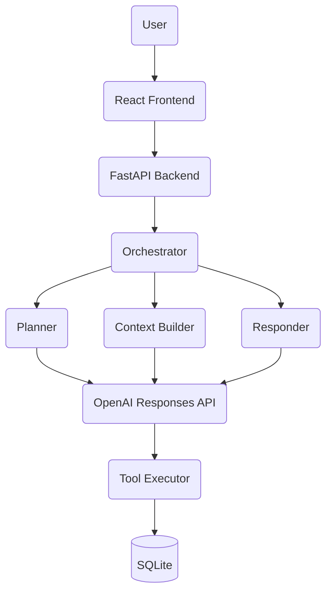

# 🧠 Personal Productivity Agent

> A full-stack AI Agent built from scratch using Python, FastAPI, OpenAI Responses API, React and SQLite.

Python
FastAPI
React
JavaScript
SQLite
OpenAI

---

## 🚀 Overview

Personal Productivity Agent is a full-stack AI agent that helps users manage tasks, habits, calendars, focus sessions and long-term memory through natural language.

Instead of relying on frameworks like LangChain, CrewAI, or AutoGen, every core component of the agent is implemented manually to better understand how modern AI systems work.

---

## ✨ Features

### 🧠 AI Agent

- Intent-based LLM Planner
- Context Builder
- Dynamic Tool Calling
- Tool Registry
- Conversation Memory
- Long-Term Memory
- Function Execution Pipeline

### ⚙️ Backend

- FastAPI REST API
- SQLite Database
- Modular Service Layer
- Planner / Executor / Responder
- Context Injection
- Productivity Statistics

### 🎨 Frontend

- React
- JavaScript
- Vite
- Chat Interface (In Progress)
- Productivity Dashboard (Planned)
- Todo Management (Planned)
- Habit Tracker (Planned)
- Calendar View (Planned)

---

## 🏗 Architecture

